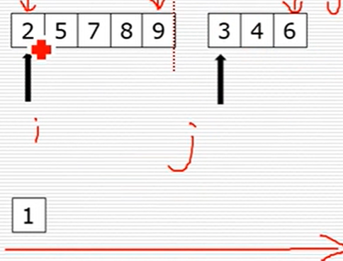
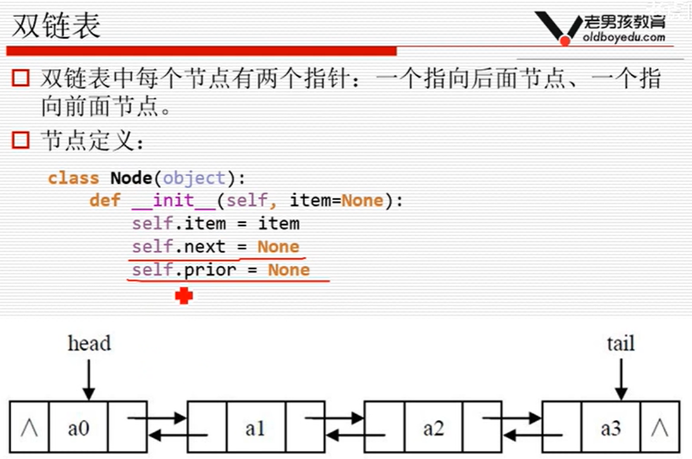
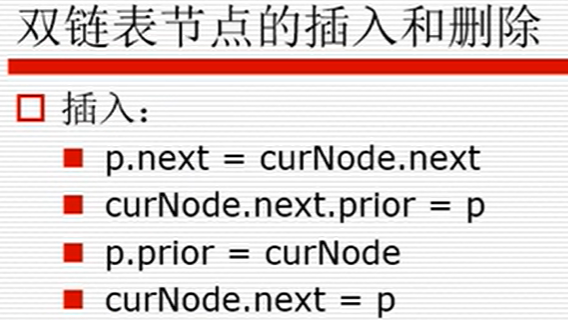
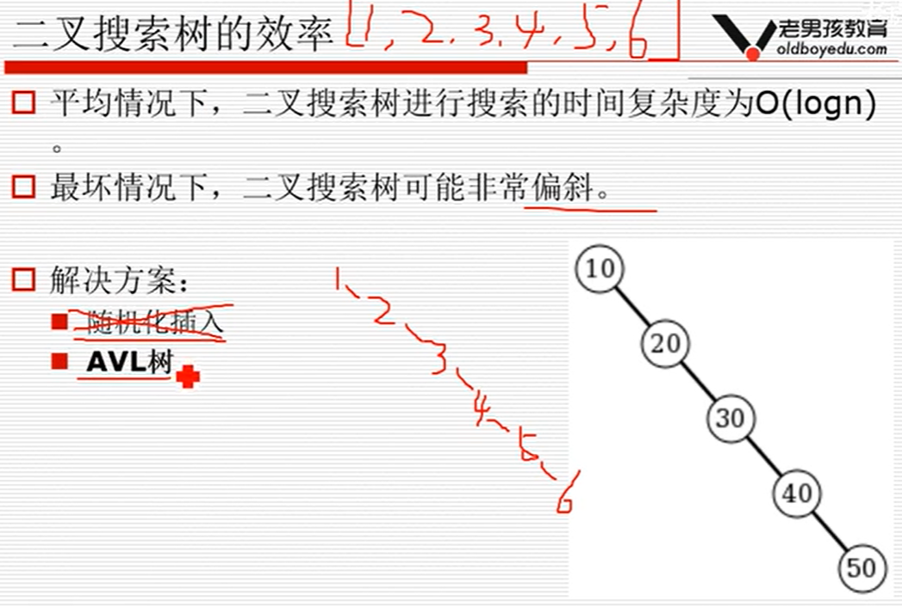
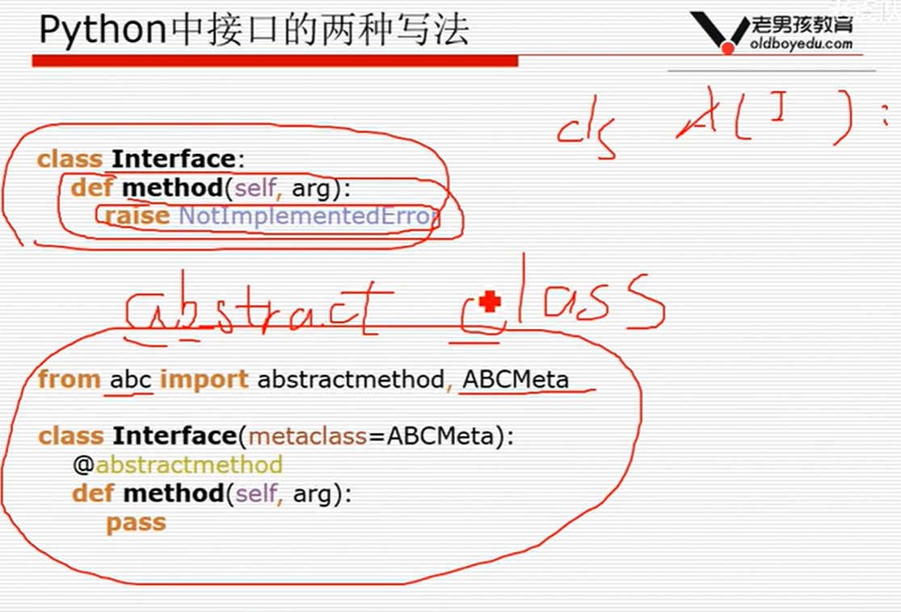

#1 算法基础
##1. 时间复杂度
###1.1常见的时间复杂度（按效率排序）

- O(1)<O(logn)<O(n)<O(nlogn)<O($n^{2}$)<O($n^{2}$logn)<O($n^{3}$)

### 1.2不常见的时间复杂度

- O(n!) O($2^{n}$) O($n^{n}$)

###1.3 一眼能判断的时间复杂度

- 循环减半过程 O(logn)

   例子：O(logn)

  ```python
  while n > 1:
      print(n)
      n = n //2
  
  ```

  

- 几次循环就是n的几次方的复杂度

    例子：O（$n^{2}$)

```
for i in range(n):
    for j in range(n):
        print("XXX")
```

## 2. 空间复杂度

例如开辟了一块n*n的空间， 则S（n) = O($n^{2}$)

## 3. 复习：递归

###3.1 递归的两个特点：

+ 调用自身

+ 结束条件

####例子：

~~~python
```
x = 3
def func3(x):
    if x > 0:
        print(x)
        func3(x-1) #  3 2 1

def func4(x):
    if x > 0:
        func4(x-1)
        print(x) #  1 2 3
```
~~~

#### 对例子的解释：

func3： （红色部分为print（x）， 最外边的框是第一次）

 

func4： （红色部分为print（x）， 最外边的框是第一次，最里面的大红色框应该为黑色）

### 

### 3.2 斐波那契数列

斐波那契数列   例如： 1  1  2  3  5  8.....

#### 3.2.1递归表达式  

$F(n)=F(n-1)+F(n-2),  (with F(0)=1 , F(1)=1), n = 2, 3, 4...$

```python
def fibnacci(n):
    if n == 0 or n == 1:
        return 1
    else:
        return fibnacci(n-1) + fibnacci(n-2)

print(fibnacci(4)) # 5
```

##### 递归粗略时间

时间装饰器:

cal_time.py

```python
import time


def cal_time(func):
    def wrapper(*args, **kwargs):
        t1 = time.time()
        result = func(*args, **kwargs)
        t2 = time.time()
        print("%s runing time: %s secs." % (func.__name__, t2-t1))
        return result
    return wrapper
             
```

recursion.py

```python
from cal_time import *


def fibnacci(n):
    if n == 0 or n == 1:
        return 1
    else:
        return fibnacci(n-1) + fibnacci(n-2)

@cal_time
def fib(n):
    return fibnacci(n)

print(fib(34)) # fib running time: 2.619 secs
    
```

#####递归算法的时间复杂度O（$2^{n}$)


从上面两张图可知， n增加1，所需计算量翻倍，所以时间复杂度是O（$2^{n}$)

#### 3.2.2 非递归

#####普通

```python
@cal_time
def fib2(n):
	li = [1, 1]
	for i in range(2, n+1):
	li.append(li[-1]+li[-2])
	return li[n]


print(fib2(100))	
```

时间复杂度O（n），空间复杂度O（n）

#####优化

我们不需要完整的li，空间有浪费，我们可优化空间复杂度，代码：

```python
@cal_time
def fib3(n):
    a = 1
    b = 1
    c = 0
	for i in range(2, n + 1):
        c = a + b
        a = b
        b = c
    return c


print(fib3(100))        
```

时间复杂度O（n），空间复杂度O（1）

#### 3.2.3 通项表达式

$a_{n} = \frac{1}{\sqrt{5}}[(\frac{1+\sqrt{5}}{2})^{n}-(\frac{1-\sqrt{5}}{2})^{n}]$ , n = 1, 2, 3...

时间复杂度O（1），空间复杂度O（1）

用Python代码运算时， 因为根号不精确， 当 n >= 70 之后， $a_{n}$误差会明显

### 3.3 递归：面试题

一段有n个台阶组成的楼梯，小明从楼梯的最底层向最高处前进， 它可以选择一次迈一级台阶或者一次迈两级台阶。问： 他有多少种不同的走法？ 

  F（n）=F（n-1）+F（n-2）

 F(1) = 1, F(2) = 1 , F(3) = 2 ...

### 

#2 查找+排序lowB三人组

## 1. 递归实例： 汉诺塔问题

n个盘子时：

1. 把n-1个圆盘从A经过C移动到B
2. 把第n个圆盘从A移动到C
3. 把n-1个小圆盘从B经过A移动到C

```python
def hanoi(n, A, B, C): 
    # A=from_pole B=through_pole C=to_pole 
    if n > 0:
        hanoi(n-1, A, C, B)
        print("%s->%s" % (A, C))
        hanoi(n-1,B, A, C)

        
hanoi(4, "A", "B", "C")    
```

不太懂的小伙伴可以查看知乎：

[Fireman A的答案](https://www.zhihu.com/question/24385418 )

## 2. 列表查找

### 2.1列表查找：从列表中查找指定元素

+ 输入： 列表， 待查元素
+ 输出： 元素下标或未查找到元素

### 2.1.1 顺序查找

+ 从列表第一个元素开始，顺序进行搜索，直到找到为止。
  + 若n是列表长度，顺序查找的时间复杂度为O(n)

### 2.1.2 二分查找

+ 从==有序== 列表的**候选区data[0:n]**开始，通过对待查找的值与候选区中间值的比较，可以使候选区减少一半。
  + 时间复杂度O(logn )

```python
li = [1, 2, 5, 67, 2, 6, 7] 


def bin_search(li, val):
    low = 0
    high = len(li)-1
    while low <= high:
        mid = (low+high) // 2
        if li[mid] == val:
            return mid
        elif li[mid] < val:
            low = mid + 1
      	else:
            high = mid - 1
 	return -1
```

####递归版本的二分查找

```python
def bin_search_rec(data_set, value,low, high):
    if low <= high:
        mid = (low+high) // 2
        if data_set[mid] == value:
            return mid
        elif data_set[mid] > value:
            return bin_search_rec(data_set, value, low, mid-1)
        else:
            return bin_search_rec(data_set, value, mid+1, high)
    else:
        return 
```

尾递归：（递归在return的地方），因为不用管递归后跳出去的事，有些例如Java，C++会优化成循环，速度会快。但是Python没有优化递归，速度比循环慢。

#### 为什么不先排序再查找

因为最快的排序是O(nlogn) + 二分查找O(logn)。 顺序查找为O(n)。 所以直接用顺序查找。

## 3. 列表排序

+ 列表排序

  + 将无序列表变为有序列表

+ 应用场景：

  + 各种榜单
  + 各种表格
  + 给二分查找用
  + 给其他算法用

+ 输入：无序列表

+ 输出：有序列表

+ 升序与降序


###  列表排序的稳定性：

例子：（2，A） （3，B） （1，C） （2，D）

排序完之后为（1，C） （2，A）（2，D） （3，B）。（2，A）（2，D）的先后位置排序前后不变。

总结：相邻两个交换的是稳定的，非相邻两个交换的不稳定。

### 排序low B三人组：

+ 冒泡排序
+ 选择排序
+ 插入排序

### 排序NB三人组：

+ 快速排序
+ 堆排序（难点）
+ 归并排序

### 没什么人用的排序：

+ 基数排序
+ 希尔排序
+ 桶排序

### 3.1 冒泡排序

思路：首先，列表每两个相邻的数，如果前边的比后边的大，那么交换这两个数 

cal_time.py在1.1章中

```python
import random 
from cal_time import*

@cal_time
def bubble_sort(li):
	for i in range(len(li)-1):# i表示第n趟 一共n或者n-1趟
		for j in range(len(li) - i - 1):#第i趟 无序区[0，n-i-1] j表示箭头 0~n-i-1
			if li[j] > li[j+1]:
				li[j], li[j+1] = li[j+1], li[j]
				

li = list(range(10000))
random.shuffle(li)
bubble_sort(li)
```

代码关键点：

+ 趟数 (n-i)
+ 无序区 (n-i-1)

#### 冒泡排序-优化

+ 如果冒泡排序中执行一趟而没有交换，则列表已经是有序状态，可以直接结束算法。

```python
import random 
from cal_time import*

@cal_time
def bubble_sort(li):
	for i in range(len(li)-1):
        exchange = False
		for j in range(len(li) - i - 1):
			if li[j] > li[j+1]:
				li[j], li[j+1] = li[j+1], li[j]
                exchange = True
      	if not exchange:
            break
				

li = list(range(10000))
random.shuffle(li)
bubble_sort(li)
```

最好情况O(n)

平均情况O(n^2)

最坏情况O(n^2)

稳定

### 3.2 选择排序

思路： 

+ 一趟遍历记录最小的数，放到第一个位置；

+ 再一趟遍历记录剩余列表中最小的数，继续放置；

```python
import random 
from cal_time import*

def get_min_pos(li):
    min_pos = 0 
    for i in range(1,len(li)):
        if li[i] < li[min_pos]:
            min_pos = i
   	return min_pos

def select_sort(li):
    for i in range(len(li)-1): # n或者n-1趟
        # 第i趟无序区范围i~最后
        min_pos = i # min——pos更新为无序区最小值位置
        for j in range(i+1,len(li)):
            if li[j] < li[min_pos]:
                min_pos = j
      	li[i], li[min_pos] = li[min_pos], li[i]
        
        
li = list(range(10000))
random.shuffle(li)
select_sort(li)
```

最好情况O(n^2)

平均情况O(n^2)

最坏情况O(n^2)

选择排序不稳定

例子： 2A 2B 1 3， 排序完  1 2B 2A 3


### 3.3 插入排序

思路：

+ 列表被分为有序区和无序区两个部分。最初有序区只有一个元素。
+ 每次无序区选择一个元素，插入到有序区的位置，直到无序区变空。

代码关键点：

+ 摸到的手牌（无序区选择的一个元素）
+ 手里的牌（有序区）

```python
import random
from cal_time import *

@cal_time
def insert_sort(li):
    for i in range(1, len(li)):# i 表示摸到的牌的下表
        tmp = li[i] #摸到的牌
        j = i - 1
        while j >= 0 and  li[j] > tmp:# 只要往后挪就循环2个条件都得满足
            # 如果 j=-1 停止挪 如果li[j]小了 停止挪
            li[j+1] = li[j]
            j -= 1
        # j位置在循环结束的时候要么是-1要么是一个比tmp小的值
      	li[j+1] = tmp

        
li = list(range(10000))   
random.shuffle(li)
insert_sort(li)        
```

最好情况O(n)

平均情况O(n^2)

最坏情况O(n^2)


# 3 快速排序

+ 快速排序：快
+ 思路：
  + 取一个元素p（第一个元素），使元素p==归位==；
  + 列表被p分成两部分，左边都比p小，右边都比p大；
  + ==递归==完成排序。

```python
def quick_sort(li, left, right):
    if left < right:#待排序的区域至少有两个元素
        mid = partition(li,left,right)
        quick_sort(li,left,mid-1)
        quick_sort(li,mid+1,right)
        
        
def partition(li,left,right):
    tmp = li[left]
    while left < right:
        while left < right and li[right] >= tmp:
        	right -= 1
  		li[left] = li[right]
    	while left < right and li[left] <= tmp:
    		left += 1
     	li[right] = li[left]
  	li[left] = tmp
    return left        
```

## 3.3.1 时间复杂度（不严谨推理）


假设我们有64个数要排序，总共需要log(n)次，每次需要n，所以最好时间复杂度为O(nlogn).

如果是倒序排列，每次只能递归一侧，则最坏时间复杂度为O(n^2)。

总结：

最好情况O(nlogn)

平均情况O(nlogn)

最坏情况O(n^2)

## 3.3.2 优化（改善倒序情况）

```python
def quick_sort(li, left, right):
    if left < right:
        mid = random_partition(li,left,right)
        quick_sort(li,left,mid-1)
        quick_sort(li,mid+1,right)
        
        
def partition(li,left,right):
    tmp = li[left]
    while left < right:
        while left < right and li[right] >= tmp:
        	right -= 1
  		li[left] = li[right]
    	while left < right and li[left] <= tmp:
    		left += 1
     	li[right] = li[left]
  	li[left] = tmp
    return left 
    
def random_partition(li,left,right):
	i = random.randint(left,right)
    li[i], li[left] =li[left],li[i]
    return partition(li,left,right)
```

增加了随机性，取得第一个数与剩下的数随机交换位置，使得第一个数有随机性，不再是倒序。其实是将可能倒序的情况时候需要消耗的更多时间，平均到各种情况的可能性里面去了。

最坏时间复杂度不变：O(n^2)。

##3.3.3 另一种版本代码

+ 方便理解但是占用空间

```python
def quick_sort2(li):
    if len(li) < 2:
        return li
    tmp = li[0]
    left = [v for v in li[1:] if v <= tmp]
    right = [v for v in li[1:] if v > tmp]
    left = quick_sort2(left)
    right = quick_sort2(right)
    return left + [tmp] + right
```

# 4 堆排序

##1.  树的介绍（铺垫知识）

+ 树是一种数据结构  比如：目录结构

+ 树是一种可以递归定义的数据结构

+ 树是由n个节点组成的集合：

  + 如果n=0, 那这是一棵空树；
  + 如果n>0, 那存在一个节点作为树的根节点，其他节点可以分为m个集合，每个集合本身又是一棵树。

+ 一些概念

  + 根节点（A），叶子节点 （BCHIPQKLMN）
  + 树的深度（高度）4 （A-E-J-P）

  + 树的度6 （A有BCDEFG，最广的）
  + 孩子节点/父节点 （B相对于A）

  + 子树（比如以D为根的树）


### 1.1 特殊且常用的树-- 二叉树

+ 二叉树：度不超过2的树（节点最多有两个叉）

#### 两种特殊的二叉树

+ 满二叉树：一个二叉树，如果每一个层的节点数都达到最大值，则这个二叉树就是满二叉树。


+ 完全二叉树：叶节点只能出现在最下层和次下层，并且最下面一层的节点都集中在该层最左边的若干位置的二叉树。


### 1.2 二叉树的存储方式

+ 链式存储方式
+ ==顺序存储方式（列表）==
+ 完全二叉树写成列表形式后，父节点位置与孩子节点位置的关系表达式
  + 父节点位置是i，左孩子位置是2i+1
  + 父节点位置是i，右孩子位置是2i+2
  + 左孩子位置或者右孩子位置是i，父节点位置是（i-1）//2


## 2.  堆排序

### 2.1 堆（特殊的完全二叉树）

+ 大根堆/大顶堆：一棵完全二叉树，满足任一节点都比其孩子节点大
+ 小根堆/小顶堆：一棵完全二叉树，满足任一节点都比其孩子节点小


### 2.2 堆的向下调整性质

+ 假设：节点的左右子树都是堆，但自身不是堆
+ 当根节点的左右子树都是堆时，可以通过一次向下的==调整==来将其变换成一个堆。
+ 具体过程，因为2比（9，7）这一层小，所以取下来放一边。用9代替2的位置。2尝试放入最开始9的位置，但是2比（8，5）小，8放在最开始9的位置，以此类推。。。

变换前：


变换后：


### 2.3 挨个出数

如上图，是一个完整的堆，9先出数，然后找最后一层的最后一个代理9的位置，进行堆的向下调整，调整完后出最顶上的数。以此类推。。。出完所有数。

### 2.4 构造堆

最开始的树


步骤：

1. 

2. 
3. 

4. 

5. 

### 2.5 堆排序总结

先运用堆的向下调整构造堆，再运用堆的向下调整挨个出数。

代码中sift（）是堆的向下调整函数，其时间复杂度为为logn，heap_sort()函数的构造堆和挨个出数的时间复杂都为nlogn，所以堆排序的时间复杂度为O(nlogn)

不稳定

最好时间复杂度：O(nlogn)

平均时间复杂度：O(nlogn)

最坏时间复杂度：O(nlogn)

### 2.6 代码

```python
import random
from cal_time import *
def sift(li, low, high):#这是堆的向下调整函数
    # li表示树，low表示树根，high表示树最后一个节点的位置
    tem = li[low]
    i = low
    j = 2*i +1 #初始j指向空位的左孩子
    # i指向空位，j指向两个孩子
    while j <= high:#循环推退出的第二种情况：j>high,说明空位i是叶子节点
        if j+1 <= high and li[j] < li[j+1]:#如果右孩子存在并且比左孩子大，指向右孩子
            j += 1
       	if li[j] > tmp:
            li[i] = li[j]
            i = j
            j = 2*i+1
    	else:# 循环退出的第一种情况：j位置的值比tmp小，说明两个孩子都比tmp小
            break
 	li[i] = tmp
 
@cal_time
def heap_sort(li):
    n = len(li)
    # 1. 构造堆
    for low in range(n//2-1, -1, -1):
        sift(li,low,n-1)
   	# 2. 挨个出数
    for high in range(n-1,-1,-1):
        li[0], li[high] = li[high], li[0] #退休 棋子
        sift(li, 0,high-1)
        

li = list(range(100))
random.shuffle(li)
print(li)
heap_sort(li)
print(li)            
```

### 2.7 Python内置堆模块

```python
import heapq

li = [9,5,7,8,2,6,4,1,3]
heapq.heapify(li)
print(li)
heapq.heappush(li,0)
print(li)
item = heap.heappop(li)
print(item)
print(li)
```

+ 利用heapq内置模块实现堆排序

```python
def heapsort(li):
    h = []
    for value in li:#将h构造成堆的列表形式
        heappush(h, value)
  	return [heappop(h) for i in range(len(h))]             
```

## 3. 堆排序扩展 -- topK问题

+ 现有n个数，设计算法找出前K大的数(k<n).
+ 解决方法：（下个笔记）

# 5 归并排序

1. 排序后切片 时间复杂度：O（nlogn+k） 

   堆排序O（nlogn）+列表切片O（k）
   
2. LowB三人组思想

   冒泡：O(kn)   外循环k内循环n

   选择： O(kn)   外循环k内循环n

   插入： O(kn)   外循环n内循环k

3. 堆的应用 O(nlogk)

   + 取列表前k个元素建立一个小根堆O(klogk)。堆顶就是目前第K大的数
   + 依次向后遍历原列表，对于列表中的元素，如果小于堆顶，则忽略该元素；如果大于堆顶，则将堆顶更换为该元素，并且对堆进行一次调整。(n-k)logk
   + 遍历列表所有元素后，倒序弹出堆顶。k(logk)

```python
import heapq

li = [9,5,7,8,2,6,4,1,3]
print(heapq.nlargest(5,li))
print(heapq.nsmallest(5,li))
```

 ## 1. 归并排序的含义

假设现在的列表分为两段有序，如何将其合成为一个有序列表





```python
def merge(li, low, mid, high):#一次归并
	# 列表两段有序： [low, mid] [mid+1, high]
	i = low # i指向第一段最小值位置
	j = mid + 1 #j 指向第二段最小值位置
	li_tmp = [] #开个临时列表存比较后的按顺序的值
	while i <= mid and j <= high: # i,j两个指针分别向后走，直到一个走完
		if li[i] <= li[j]:
			li_tmp.append(li[i])
			i += 1
		else:
			li_tmp.append(li[j])
			j += 1
  	#另一个没走完的继续走，因为我们不确定是哪个，所以写两个while
  	while i <= mid:
  		li_tmp.append(li[i])
  		i += 1
  	while j<= high:
  		li_tmp.append(li[j])
  		j += 1
  	# li_tmp[0:high-low+1] 写回去 li[low:high+1]
  	for i in range(low, high+1):
  		li[i] = li_tmp[i-low]


li = [2,5,7,8,9,1,3,4,6]
merge(li, 0, 4, 8)
print(li)


def merge2list(li1, li2):
	#上边给的是一个list，分为两个顺序的部分。现在给两个顺序的list，输出一个总顺序的list
    li = []
    i = 0
    j = 0
    while i < len(li1) and j < len(li2):
        if li1[i] <= li2[j]:
            li.append(li1[i])
            i += 1
      	else:
            li.append(li2[j])
            j += 1
   	while i < len(li1):
        li.append(li1[i])
        i += 1
  	while j < len(li2):
        li.append(li2[i])
        j +=1
 	return li


li1 = [2,5,7,8,9]
li2 = [1,3,4,6]
li = merge2list(li1,li2)
print(li)
```


```python
 def merge_sort(li, low, high):#排序li的low到high的范围
        if low < high:
            mid = (low+high) //2
            merge_sort(li, low, mid)
            merge_sort(li, mid+1, high)
            merge(li,low,mid,high)
```

## 2. 归并排序时间复杂度

时间复杂度： O(nlogn)

一次归并的时间复杂度O(n),总共分解次数logn，合并次数logn，总共O(nlogn+nlogn)

空间复杂度 O(n)，因为开了最大存n的列表

## NB三人组—小结

+ 三种排序算法的时间复杂度都是O(nlogn)
+ 一般情况下，就运算时间而言：
  + 快速排序 < 归并排序 < 堆排序
+ 三种排序算法的缺点：
  + 快速排序：极端情况下排序效率低
  + 归并排序：需要额外的内存开销
  + 堆排序： 在快的排序算法中相对较慢

## 所有排序的总结


# 6 希尔排序+计数排序+桶排序

## 1. 希尔排序（Shell）


**第一步**

先分成上下四行


每行插入排序


复原


**第二步**

先分成上下两行


每行进行插入排序


复原


**第三步**

分成上下一行（就等于不分）


每行插入排序


结束

### 代码实现

```python
def insert_sort_gap(li,d):
    for i in range(d, len(li)): # i表示摸到的牌的下标
        tmp = li[i] #摸到的牌
        j = i -d
        while j >=0 and li[j] > tmp #2个条件满足时手里牌往后挪
        #如果j=-1 停止挪 如果li[j]小了停止挪
        li[j+d] = li[j]
        j -= d
        # j位置在循环结束时要么是-1要么是一个比tmp小的值
        li[j+d] = tmp
        
def shell_sort(li):
    d = len(li) //2
    while d >0:
        insert_sort_gap(li,d)
        d = d//2
```

### 时间复杂度

时间复杂度比较复杂，并且和选取的GAP序列有关。具体见WIKI

## 2. 计数排序(count)

现在有一个列表，已知列表中的数范围都在0到100之间。设计算法在O（n）时间复杂度内将列表进行排序。

## 例子

待排序的数组 1 0 4 2 1 3 4 1 2 4 1 3 0 1

每个数出现的次数 2 5 2 2 3

结果： 0 0 1 1 1 1 1 2 2 3 3 4 4 4

```python
def count_sort(li, max_num=100):
    count = [0 for i in range(max_num+1)] 
    for val in li:
        count[val] += 1
   	li.clear()
    for i,v in enumerate(count):# 表示i这个数出现了v次
     	for i in range(v):
            li.append(i)
        
```

## 3. 桶排序


最坏时间复杂度是O（n^2k)

# 7 基数排序(radix)

  


我的理解：例如有多关键词排序先数字后字母：（1，a），（3，b），（2，b），（2，a）。

1. 先把他们分成（1，a）   （2，b），（2，a）  （ 3，b）三组。
2. 然后对每组组内排序，得（1，a）（2，a）（2，b）（ 3，b）。

这个**等价于**

1. 以字母为关键字排序（1，a）（2，a）（ 3，b）（2，b）
2. 排好后，以数字为关键字使用稳定排序（排序的数字相同时，在前面的依然在前面），得（1，a）（2，a）（2，b）（ 3，b）。

==也就是说，我们可以用平时思考的排序逻辑，转化成方便写成程序的逻辑，这两种逻辑是等价的==

## 1. 课外的代码(无关基数排序)

```python
def get_digit(num, i):#例如给你123，分别取1，2，3
    #i=0 各位 1十位 2百位...
    return num // (10**i)%10

def reverse_list(li):
  	n = len(li)
   	for i in range(n // 2):
        li[i], li[n-i-1] = li[n-i-1],li[i]

def int2list(num):
    li = []
    while num>0:
        li.append(num%10)
        num = num//10
 	li.reverse()
    return li

def reverse_int(num):#-1230 >-321
    is_neg = False
    if num < 0:
        is_neg = True
        num = -1 * num
        
    res = 0
    while num > 0:
        res = res * 10
        res += num % 10
        num = num // 10  
        
  	if is_neg:
        res = res* -1
  	return res
```

## 2. 代码实现

```python
def radix_sort(li):
	max_num = max(li)#找到最大位数的数字，因为123最大，就需要补充12为，012
    i = 0
    while(10**i <= max_num):
        buckets = [[] for i in range(10)]
        for val in li:#装进桶里
            digit = val // (10** i) % 10
            buckets[digit].append(val)
       	li.clear()
        for bucket in buckets:#从桶里排回去
            for val in bucket:
                li.append(val)
        i += 1
```

## 3. 时间复杂度


# 数据结构


# 8 顺序表

## 1. 什么是数据结构


##2. 数据结构的分类


## 1. 列表

### 1.0 列表的定义


### 1.1 32位的实质

内存空间，最多有2^32个空间，每个空间1字节（Byte）,所以相当于最大4G内存。

32位机器中，每个地址占4个字节。

64位机器中，每个地址占8个字节。

### 数组的下标运算的实质


一个int类型的数占有四个字节。那么int a[5], 产生一个拥有5个int类型的数组，相当于程序向操作系统，操作系统再向内存，要了一块300-319的地址的内存。

### 1.2 数组与列表的区别

1. 数组创建时必须规定数组长度，列表不用

2. 数组内的东西必须一种类型，列表不用

###1.3 列表可以扩展长度的实质

###

比如刚开始生成了一个列表可以装4个元素。当装满的时候，新生成一个翻倍容量的空列表，把前面4个元素复制过去。append操作的时间复杂度为O（3）。

### 1.4 Python 列表可以存不同类型的实质

列表里其实保存的是地址，在32位机器里地址占4个字节，地址再指向不同类型的元素。


# 9 堆栈（stack）队列

##栈

堆栈是早年的叫法，其实就是指栈。

## 1. 栈的定义


## 2. Python栈的实现


## 3. 栈相关的面试题


```python
def brace_match(s):
    stack = []
    d = {'(':')','[':']','{':'}'}
    for ch in s:
        if ch in {'(','[','{'}:
            stack.append(ch)
       	elif len(stack) == 0:
            print('多了右括号%s'%ch)
           	return False
      	elif d[stack[-1]] == ch:
            stack.pop()
      	else:
            print('括号%s处不匹配' % ch)
            return False
  	if len(stack) == 0:
        return True
    else:
        print("剩余左括号未匹配")
        return False
```

## 队列

## 1. 队列的定义


## 2. 队列的实现


### 2.2 用两个栈实现队列


```python
from collections import deque

q = deque() #双向队列
q.append(1) 
q.append(2)
q.append(3)
print(q.popleft())
```


# 10  迷宫问题


## 1. 方法一：深度优先搜索（DFS Depth First Search）


根据“上右下左”顺序一直走，每一步都放在一个栈里，当“上右下左”都不能走时出栈，直到有个还能继续走的格子，继续执行“上右下左”。若最后全部出栈，即起点也出栈了，则无路可走。

```python
maze = [ #在这个迷宫里，从上到下是x，从左到右是y
[1,1,1,1,1,1,1,1,1,1],
[1,0,0,1,0,0,0,1,0,1],
[1,0,0,1,0,0,0,1,0,1],
[1,0,0,0,0,1,1,0,0,1],
[1,0,1,1,1,0,0,0,0,1],
[1,0,0,0,1,0,0,0,0,1],
[1,0,1,0,0,0,1,0,0,1],
[1,0,1,1,1,0,1,1,0,1],
[1,1,0,0,0,0,0,0,0,1],
[1,1,1,1,1,1,1,1,1,1]
]

dirs = [
    lambda x,y: (x-1, y),  #上
    lambda x,y: (x, y+1),  #右
    lambda x,y: (x+1, y),  #下
    lambda x,y: (x, y-1)   #左
]

def slove_maze_stack(x1,y1,x2,y2):
	stack = []
    stack.append((x1,y1))
    while len(stack) >0: # 当栈不空时循环
        cur_node = stack[-1] # 当前所在节点
        if cur_node == (x2, y2): # 如果到终点了
            print(stack)
            return True
        for d in dirs:
            next_node = d(*cur_node)
            if maze[next_node[0]][next_node[1]] == 0:
                stack.append(next_node) # 把node放在栈里就是走
                maze[next_node[0]][next_node[1]] == 2 #把走过的路用2区别出来
                break #能走就不看其他方向了
        else：# 当四个方向都走不通，把cur_node出栈
        	stack.pop()
	else:
        print("无路")
        return False            
```

## 2. 方法二： 广度优先搜索（BFS Breadth first search）


具体执行过程如下图，起点（1，1）先进队列（队列右进左出），然后有两条路可以走，那么（1，1）出队，（1，2）和（2，1）根据“右下左上”进队。然后循环这步骤。


那么如何找到那条出去的路径呢？

我们在（1，1）后面加上是谁带这个节点进来的，然后在出队列时，用一个列表储存出队列的元素。如下图


```python
from collections import deque
maze = [ #在这个迷宫里，从上到下是x，从左到右是y
[1,1,1,1,1,1,1,1,1,1],
[1,0,0,1,0,0,0,1,0,1],
[1,0,0,1,0,0,0,1,0,1],
[1,0,0,0,0,1,1,0,0,1],
[1,0,1,1,1,0,0,0,0,1],
[1,0,0,0,1,0,0,0,0,1],
[1,0,1,0,0,0,1,0,0,1],
[1,0,1,1,1,0,1,1,0,1],
[1,1,0,0,0,0,0,0,0,1],
[1,1,1,1,1,1,1,1,1,1]
]

dirs = [
    lambda x,y: (x-1, y),  #上
    lambda x,y: (x, y+1),  #右
    lambda x,y: (x+1, y),  #下
    lambda x,y: (x, y-1)   #左
]

def solve_maze_queue(x1, y1, x2, y2):
    q = deque()
    q.append((x1, y1, -1))# 起点位置，-1在这里就是none，为了区别0
   	maze[x1][y1] = 2 # 走过的地方用2区别开
    traceback = [] # 把出队的节点放在这个列表
	while len(q) > 0: # 队不空时循环
        cur_node = q.popleft()  #当前节点出队
        trackback.append(cur_node)  # 出队的节点放在这个列表
        if cur_node[:-1] == (x2,y2): # 检查是否到终点了，扔掉元组内最后一个值	
            path = []
            i = len(traceback) - 1
            while i >= 0:
                path.append(traceback[i][0:2])
                i = traceback[i][2]
         	path.reverse()
            print(path)
            
            #注释掉，之前是想看traceback列表内容
            #for i,v in enumerate(traceback):
            #   print(i,v)
          	#return
        
        for d in dirs:# 各个方向的下个节点
            next_x, next_y = d(cur_node[0], cur_node[1])
            if maze[next_x][next_y] == 0: # 这里考虑各个方向的分叉路线，无需break	
                q.append((next_x,next_y, len(traceback)-1))
                maze[next_x][next_y] = 2 #标记已走过的路
 	else：# 队内元素都出去了，即路都走死了    
    	print("无路")
        return False        
```

## 广度优先搜索保证了最短路径之一

因为每个节点都是所有可以走的下个节点，出来的结果保证是最短路径其中之一。

#  11 链表

## 1.1 链表的定义


```python
class Node:
    def __init__(self,data):
        self.data = data
        self.next = None
 
# 第一种写法，不推荐，因为无法表示空链表的情况
a = Node(1)
b = Node(2)
c = Node(3)
a.next = b
b.next = c
head = a


# 第二种写法，推荐，原因如下
# 我们必须要留一个空的头结点，来保证空链表的情况可以表示。头结点的位置，我们也可以保存链表长度的信息   
# 带空头结点的链表
head = Node() # 头结点
a = Node(1) 
b = Node(2)
c = Node(3)
head.next = a
a.next = b
b.next = c

print(a.next.data)# a.next是下一个对象b，拿到b里面的data
	
```

## 1.2 建立链表（头插法）


### 切记！
插入元素先指向后结点，此处3先指向2，再让0指向3. 不然，先动0指向2的话，会让2永远找不到。


```python
class Node:
    def __init__(self, data=None):
        self.data = data
        self.next = None
        
        
class LinkList:
    def __init__(self):
        self.head = None
        
    # 头插法
    def create_linklist_head(self, li): # 传入列表转成链表
        self.head = Node(0)
        for v in li:
            n = Node(v) # 建一个新的未串联的结点n，把其串到链表中
            n.next = self.head.next #运用“切记！”里的3先串联2
            self.head.next = n
            self.head.data += 1
            
     #输出链表中所有元素
    def traverse_linklist(self):
        p = self.head.next
        while p:
            print(p.data)
            p = p.next

```

## 1.3 建立链表（尾插法）

步骤：


```python
class Node:
    def __init__(self, data=None):
        self.data = data
        self.next = None
        
        
class LinkList:
    def __init__(self):
        self.head = None
        
    # 尾插法
    def create_linklist_tail(self, li):
        self.head = Node(0)
        self.tail = self.head # 我们需要一个变量记录tail的位置
        for v in li: # 对于列表中每个元素,运用上面步骤
            p = Node(v)
            self.tail.next = p
            self.tail = p
            self.head.data += 1
                     
#输出链表中所有元素
    def traverse_linklist(self):
        p = self.head.next
        while p:
            print(p.data)
            p = p.next   
```

## 1.4 链表节点的插入和删除

### 插入步骤


### 删除步骤


## 2.1 双链表的定义



## 2.2 双链表节点的插入和删除

### 插入步骤




### 删除步骤


## 2.3 链表与列表 复杂度对比 


+ 按元素值查找 

  列表O(logn)二分查找 链表O(n)

+ 按下标查找

  列表O(1)  链表O(n)

+ 在某元素后插入

  列表O(n)  链表O(1)

+ 删除某元素

  列表O(n)  链表O(1)

# 12 哈希表

## 1.1哈希表的定义


## 1.2 直接寻址表


## 1.3 哈希表

因为直接寻址表的缺点，我们用哈希表


### 1.3.1 哈希冲突


### 1.3.2 解决哈希冲突方法1--开放寻址法


### 1.3.3解决哈希冲突方法2--拉链法


连接一个链表是因为，链表方便增加和删除，列表不方便。

## 1.4 哈希表在Python中运用


# 13 二叉树


## 1. 二叉树的遍历

DFS（深度优先搜索）：

+ 前序遍历
+ 中序遍历
+ 后序遍历

BFS（广度优先搜素）：

+ 层次遍历

## 2. 遍历代码

```python
from collections import deque

class BiTreeNode:
    def __init__(self,data):
        self.data = data
        self.lchild = None
        self.rchild = None
        
a = BiTreeNode("A")
b = BiTreeNode("B")
c = BiTreeNode("C")
d = BiTreeNode("D")
e = BiTreeNode("E")
f = BiTreeNode("F")
g = BiTreeNode("G")

e.lchild = a
e.rchild = g
a.rchild = c
c.lchild = b
c.rchild = d
g.rchild = f

root = e

#前序遍历
#前序遍历相当于递归，递归相当于栈，后进先出，先左后右，进栈出栈。所以前序遍历顺序EACBDGF
def pre_order(root):
    if root:
        print(root.data,end="")
        pre_order(root.lchild)
        pre_order(root.rchild)
        
pre_order(root)

# 中序遍历
# ABCDEGF
def in_order(root):
    if root:
        in_order(root.lchild)
        print(root.data,end="")
        in_order(root.rchild)        
# 后序遍历   
# BDCAFGE
def post_order(root):
    if root:
        post_order(root.lchild)
        post_order(root.rchild)
        print(root.data,end="")
        
#层次遍历
#把每一层上的节点都按从上到下从左到右输出，运用队列。
def level_order(root):
    q = deque()
    q.append(root)
    while(len(q)>0):#当队列不空时循环
        x = q.popleft() #x是出队的节点
        print(x.data, end="")
        if x.lchild:#出队节点如果有左孩子
            q.append(x.lchild)#左孩子进队
     	if x.rchild:#出队节点如果有右孩子
            q.append(x.rchild)#右孩子进队
                  
```

## 3. 二叉树面试题

+ 根据给出的一棵二叉树，写出各种遍历
+ 写出二叉树各种遍历的代码
+ 根据先序+中序遍历，画出原来的二叉树
  + 我们只需要根据先序确定每次进栈的根节点，然后用中序分成左右。例如：先序EACBDGF，中序ABCDEGF。
    1. 先序确定根E，中序确定左子树ABCD，右子树GF。
    2. 进入E的左子树，先序确定根A，中序确定A的右子树BCD
    3. 先序确定C，C的左子树B，C的右子树D
    4. 然后进入E的右子树G，然后G的右子树F
+ 根据后序+中序遍历，画出原来的二叉树
  + 与先序+中序类似，但是后序的根是最后一个元素。

## 4. 多叉树情况

+ 多叉树不再用左孩子（lchild）右孩子（rchild）来保存之后的节点，而是用一个list来保存。（我们将构造方法里self.lchild和self.rchild改写成self.children=[ ]
+ 多叉树没有中序遍历，但是有先序和后序遍历，只需要在两个递归处写成for循环
+ 多叉树有层次遍历

## 5. 二叉树的应用：二叉搜索树


+ 二叉搜索树作用是实现字典，集合方式，另一种是哈希表

+ 字典需要查询，插入，删除速度要快

1. 查询速度O（logn），因为总共n个数，每次查询都分到左或者右子树，查一次减半。
2. 插入速度也是O（logn）。原理跟查询相同

### 5.1 二叉搜索树的插入和查找操作代码

```python
# 二叉搜索树
# binary search tree

class BiTreeNode:
    def __init__(self,data):
        self.data = data
        self.lchild = None
        self.rchild = None

class BST:
    def __init__(self,li):
        self.root =None
     	if li:
            for val in li:
                self.insert(val)
    #二叉搜索树的插入操作
  	def insert(self, key): #key是要插入的字典里的key，上面图里的值都指字典里的键
        if not self.root: #如果root是空的话
            self.root = BiTreeNode(key) #建一个Node
      	else：
        	p = self.root #p是一个指针，指向从根开始的键，如果root有值，我们拿p指向root
            while p: 
                if key < p.data: # key要存储在左子树
                    if p.lchild: # 如果左子树有节点，往左子树走，继续看
                        p = p.lchild
                   	else: #如果左子树是空，就插入到左孩子的位置
                        p.lchild = BiTreeNode(key)
                        break
              	elif key > p.data:
                    if p.rchild:
                        p = p.rchild
                   	else:
                        p.rchild = BiTreeNode(key)
                        break
              	else:
                    break
                    
     #二叉搜素树的查找操作              
  	def query(self, key):
        p = self.root # 用p指向root
        while p:
            if key < p.data:
                p = p.lchild
          	elif key > p.data:
                p = p.rchild
          	else:
                return True
    	return False
    
    
#用中序遍历来排序	                        
 	def traverse(self):
        def in_order(root):
            if root:
                in_order(root.lchild)
                print(root.data,end=',')
                in_order(root,rchild)
     	in_order(self.root)
        
        
tree = BST([5,4,6,8,7,1,9,2,3])
tree.traverse()         
```

### 5.2 时间复杂度

+ 排序
  + 用二叉搜索树先插入list里的各个值到二叉树中，再用中序遍历输出。
  + 时间复杂度O（nlogn）
+ 查询和插入
  + 有n个数，查询和插入一个数的时间复杂度O（logn）

### 5.3 二叉搜索树的删除操作


 


### 5.4 删除操作的代码

```python
class BiTreeNode:
    def __init__(self, data):
        self.data = data 
        self.lchild = None
        self.rchild = None
        self.parent = None


    def _remove_node_1(self, node): # 删除的第一种情况
        if not node.parent： # 根节点
            self.root = None
        elif node == node.parent.lchild # 是父亲的左孩子
            node.parent.lchild = None
        else: # 是父亲的右孩子
            node.parent.rchild = None
        

    def _remove_node_21(self, node):
        if not node.parent: # 根节点
            self.root = node.rchild
            self.root.parent = None
        elif node == node.parent.lchild:
            node.parent.lchild = node.rchild
            node.rchild.parent = node.parent
        else:
            node.parent.rchild = node.rchild
            node.rchild.parent = node.parent
            
            
   	def delete(self, val):
        if self.root: # 不是空树
            node = self.query_no_rec_(val)
            if not node: # 如果不存在该节点
                return False
            if not node.lchild and not node.rchild: # 1.叶子节点
                self._remove_node_1(node)
          	elif not node.lchild: #2.1 只有一个右孩子
                self._remove_node_21(node)
            elif not node.rchild: #2.2 只有一个左孩子    
              	self._remove_node_22(node)
            else：       #3. 有两个孩子
            	# 找到右子树中的最小节点
                min_node = node.rchild
                while min_node.lchild:
                    min_node = min_node.lchild
              	node.data = min_node.data
                # 删除该节点
                if min_node.rchild:
                    self._remove_node_21(min_node)
                else:
                    self._remove_node_1(min_node)
    

        
    
```

### 5.5 查询的效率（最坏情况）



#### 5.5.1 AVL树


##### 插入操作导致不平衡


##### 解决方法


### 5.6 B树


# 14 算法习题

Leetcode上的题目讲解

#15 设计模式




## 设计模式六大原则


## 设计模式的分类


### 创建型模式：

#### 简单工厂模式


#### 工厂方法模式


